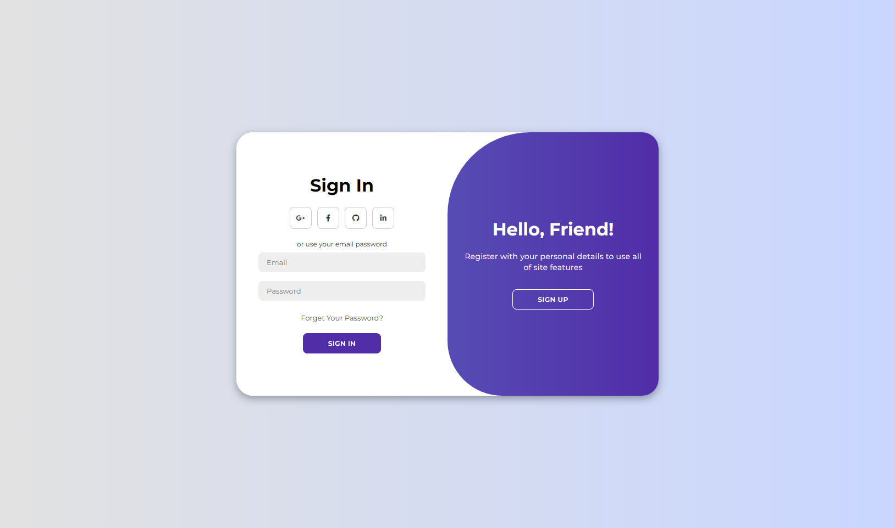
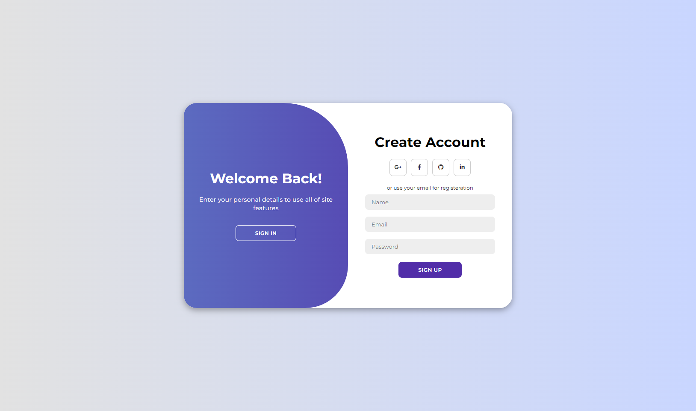

<h1 align="center"> Login Page </h1>

Uma página simples e interativa de login e cadastro 🚀🔥

  <a href="#-tecnologias">Tecnologias</a>&nbsp;&nbsp;&nbsp;|&nbsp;&nbsp;&nbsp;
  <a href="#-projeto">Projeto</a>&nbsp;&nbsp;&nbsp;|&nbsp;&nbsp;&nbsp;
  <a href="#-links">Links</a>

 

  

  

## 🚀 Tecnologias

Esse projeto foi desenvolvido com as seguintes tecnologias:

- HTML 
- CSS
- JavaScript
- Git e Github

    

## 💻 Projeto

Um projeto simples com uma tela de login/cadastro interativa.

## 🔗 Links

 